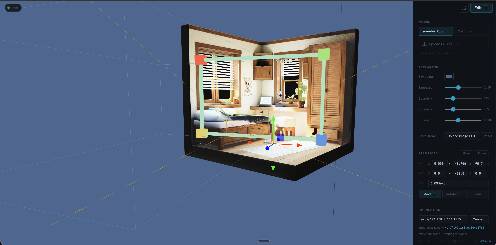
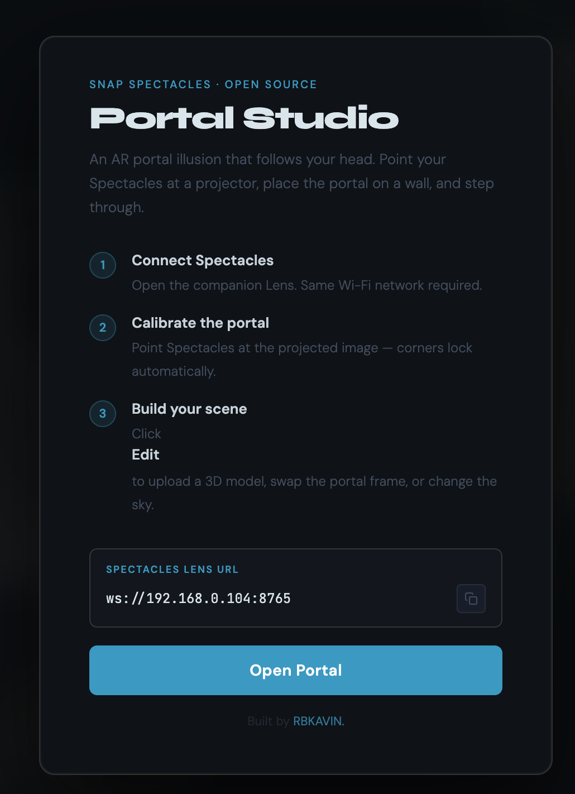
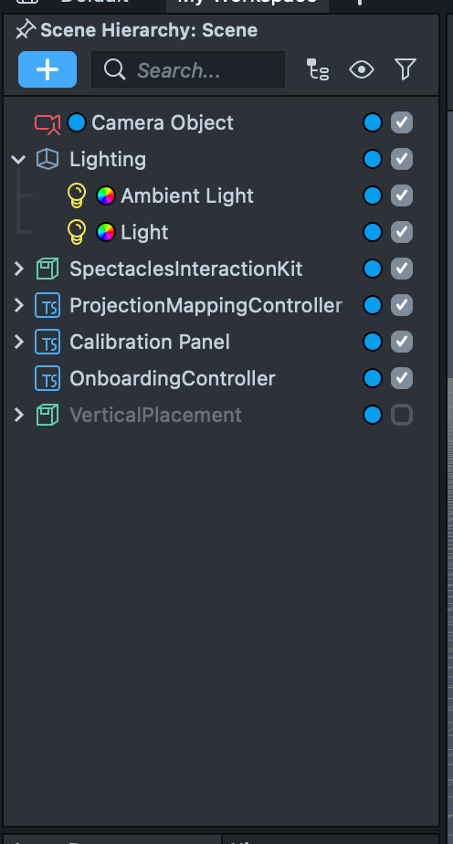
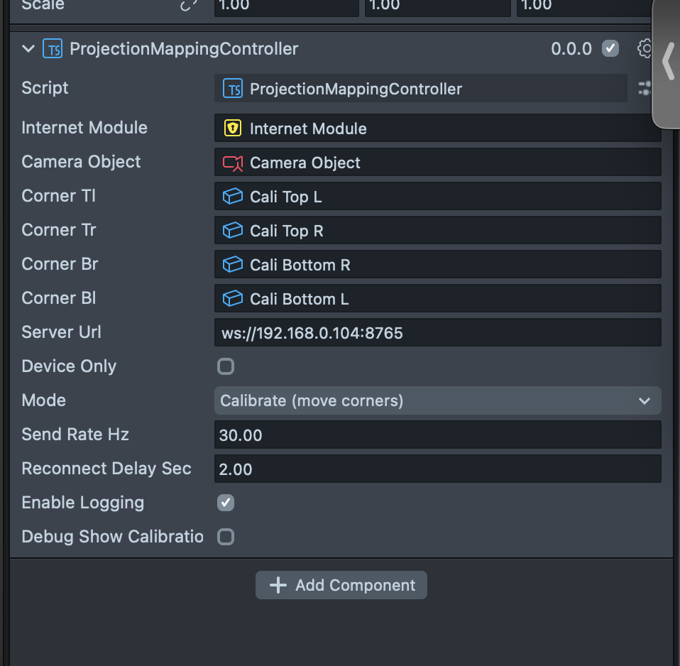
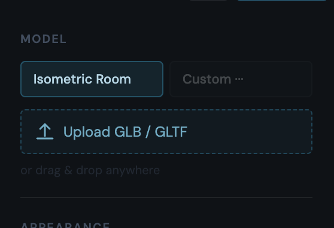
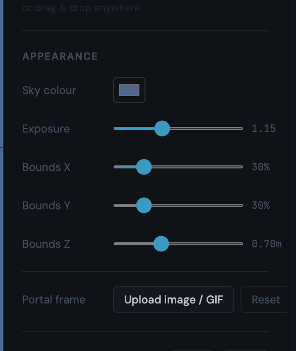
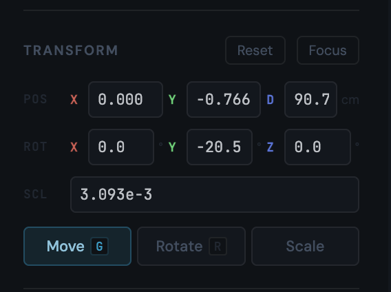

# Projection Mapping Portal

A real-time parallax portal experience for Snap Spectacles 2024 and a projector. Point a projector at a wall, wear the glasses, pinch the 4 corners of the projected image — the 3D scene inside shifts perspective as you move your head, like a window into another space.



---

## How it works

A projector shows a 3D scene on the wall. Snap Spectacles track your head position in real time and stream it over WebSocket to the laptop running the web app. The web app uses an off-axis frustum projection to recompute the exact viewpoint each frame — so the scene parallaxes correctly as you move, the same way a real window would.

Calibration is done in AR: pinch each corner of the projected rectangle while wearing the glasses and the system builds the coordinate mapping automatically. No physical measurements, no desktop calibration software.

---

## Requirements

- Snap Spectacles 2024
- A projector pointed at a flat wall
- A laptop on the same Wi-Fi network as the Spectacles
- Node.js (v18+)

---

## Setup

**1. Start the web server**

```bash
cd web
npm install
node server.js
```

The terminal will print your local URL and WebSocket address. Open that URL in a browser on the laptop.

**2. Open the Lens**

The splash screen shows the WebSocket URL to enter into the Lens. Copy it with the button and paste it into the Spectacles Lens URL field in the Lens inspector.



**3. Configure the Lens in Lens Studio**

Open the project in Lens Studio. The scene hierarchy has everything already wired:



Select the `ProjectionMappingController` object and set the **Server Url** field to your laptop's WebSocket address (same one shown on the splash screen). Leave **Mode** on **Calibrate**.



**4. Calibrate**

Put on the Spectacles. The Lens connects automatically. Point your hand at each of the 4 corners of the projected image on the wall and pinch to place a marker — order doesn't matter, the system auto-sorts them. After the 4th corner a Confirm button appears floating in the centre — pinch it to lock calibration and go live.

**5. Experience**

Move your head. The scene shifts in parallax. The projector image stays fixed on the wall but appears to have real depth behind it.

---

## Web app controls

### Model

Upload any GLB or GLTF file as the scene content. The built-in default is an isometric room. You can also drag and drop a file anywhere onto the window.



### Appearance

Set the background sky colour, exposure, movement bounds per axis, and upload a portal frame image or GIF that overlays the projection edges.



- **Bounds X / Y** — how far the parallax camera can drift laterally and vertically, as a percentage of the portal size. Lower = content stays more locked
- **Bounds Z** — max depth shift in metres when walking toward/away from the wall. Default is very small so this has minimal effect

### Transform

Fine-tune position, rotation, scale and depth of the 3D model. Switch between Move / Rotate / Scale gizmo modes. Reset resets to default, Focus zooms the edit camera onto the model.



| Keyboard | Action |
|---|---|
| `T` | Toggle edit mode |
| `Shift + Arrow keys` | Move model X / Y |
| `Shift + W / S` | Push model deeper / closer |
| `[ ]` | Scale model down / up |
| `G` | Switch gizmo to Move |
| `R` | Switch gizmo to Rotate |
| `F` | Toggle fullscreen |

---

## Project structure

```
Assets/Scripts/
  ProjectionMappingController.ts   — corner placement, auto-sort, calibration lock, pose streaming
  OnboardingController.ts          — AR onboarding state machine (connecting → calibrating → confirming → live)

web/
  server.js                        — Node.js WebSocket relay + static file server
  public/
    app.js                         — Three.js scene, parallax, model loading, UI
    calibration.js                 — coordinate mapping from Specs space to web space
    portal-projection.js           — off-axis frustum projection
    orbit-debug.js                 — edit-mode orbit camera and portal frame visualiser
    index.html
    styles.css
```

---

## Tech stack

- **Spectacles side:** TypeScript, Lens Studio, SpectaclesInteractionKit, SpectaclesUIKit, WorldQueryModule
- **Web side:** vanilla JavaScript (ES modules), Three.js
- **Server:** Node.js, `ws`

No build step — the web side is plain ES modules served directly.

---

## Made by

Kavin Kumar Balamurugan — [rbkavin.studio](https://rbkavin.studio/k/)
